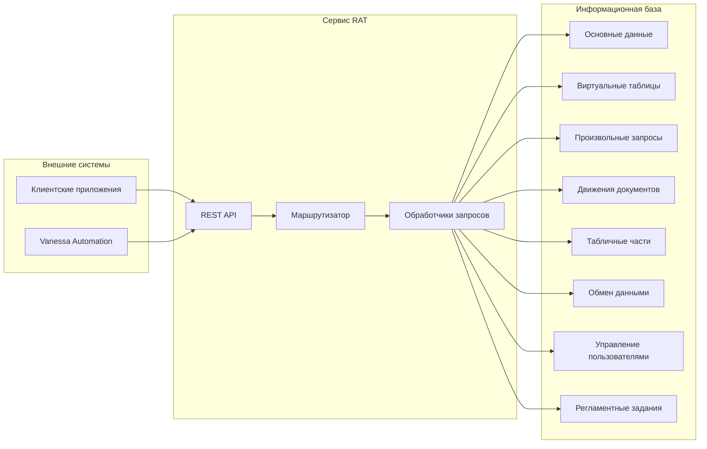
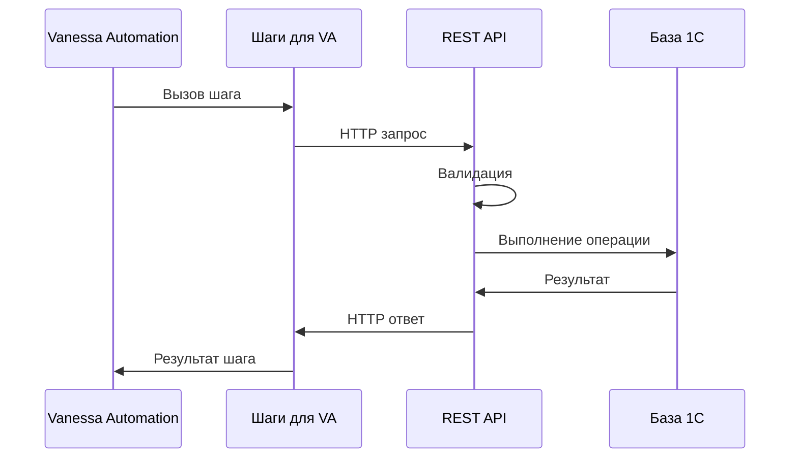
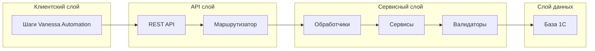

# Архитектура системы

## 1. Высокоуровневая архитектура

## 2. Детальное описание компонентов

### 2.1. Сервис RAT - REST API

Основные компоненты:
- **API Gateway**
  - Обработка входящих HTTP запросов
  - Маршрутизация запросов к соответствующим обработчикам
  - Валидация входных данных
  - Формирование ответов

- **Обработчики запросов**
  - CRUD операции с данными
  - Управление регламентными заданиями
  - Работа с движениями документов
  - Расширенный поиск

- **Сервисный слой**
  - Бизнес-логика
  - Трансформация данных
  - Валидация бизнес-правил

### 2.2. Интеграция с Vanessa Automation

Основные компоненты:
- **Шаги Vanessa Automation**
  - Поиск данных
  - Создание данных
  - Изменение данных
  - Удаление данных
  - Работа с регламентными заданиями

- **Интеграционный слой**
  - Преобразование данных
  - Обработка ошибок
  - Логирование

## 3. Взаимодействие компонентов

### Краткое описание взаимодействия:

1. **Клиентский слой**
   - Обеспечивает интерфейс для Vanessa Automation
   - Форматирует данные для передачи
   - Обрабатывает результат выполнения

2. **API слой**
   - Обрабатывает HTTP запросы
   - Маршрутизирует запросы к нужным обработчикам

3. **Сервисный слой**
   - Содержит бизнес-логику
   - Валидирует данные

4. **Слой данных**
   - Взаимодействует с базой 1С