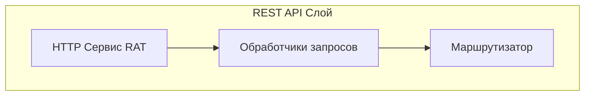

# Реализация REST API слоя

## 1. Общая архитектура

REST API слой реализован как HTTP сервис с использованием встроенных механизмов платформы 1С. Основные компоненты:

## 2. Основные компоненты

### 2.1. HTTP Сервис (RAT)

- **Конфигурация:**
  - Корневой URL: `/test-api`

- **Основные эндпоинты:**
  - `/spec.json` - спецификация API в формате OpenAPI
  - `/spec-ui` - веб-интерфейс документации API
  - `/*` - обработка всех остальных запросов

### 2.2. Обработчики запросов

#### 2.2.1. Основные обработчики

- **СпецификацияGET** `GET: /spec.json`
  - Возвращает спецификацию API в формате OpenAPI v3
  - Используется для документирования и тестирования

- **ИнтерфейсСпецификацииGET** `GET: /spec-ui`
  - Возвращает HTML страницу с документацией API
  - Использует общий макет "РатИнтерфейс"

- **APIANY** `/*`
  - Обрабатывает все остальные запросы
  - Маршрутизирует запросы к соответствующим обработчикам

### 2.3. Маршрутизация

- Используется система шаблонов URL
- Поддержка параметров в пути
- Группировка обработчиков по функциональности

## 3. Детали реализации

### 3.1. Аутентификация и безопасность

- **Механизм аутентификации:**
  - Использование встроенных механизмов 1С

- **Безопасность:**
  - Валидация входных данных

### 3.2. Обработка ошибок

- **Стандартные коды ответов:**
  - 200: Успешное выполнение
  - 400: Ошибка в запросе
  - 401: Требуется аутентификация
  - 403: Доступ запрещен
  - 404: Ресурс не найден
  - 500: Внутренняя ошибка сервера

### 3.3. Форматы данных

- **Входные данные:**
  - JSON формат
  - UTF-8 кодировка

- **Выходные данные:**
  - JSON формат
  - UTF-8 кодировка
  - Форматирование дат в ISO 8601
